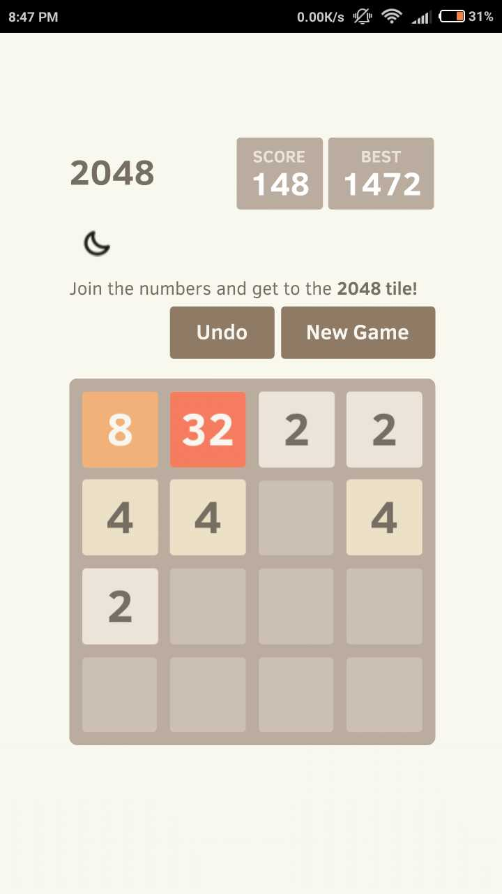
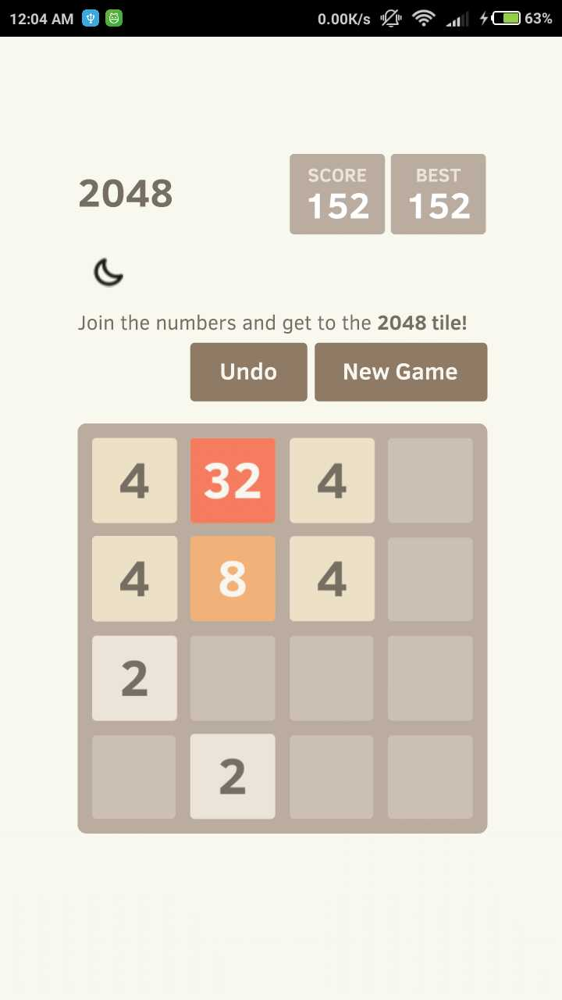
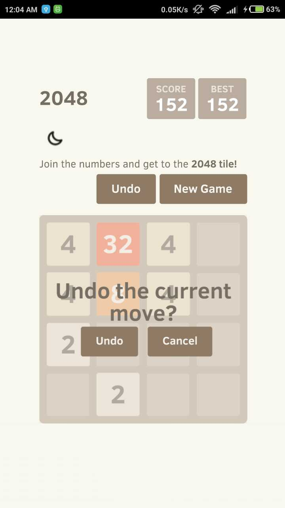
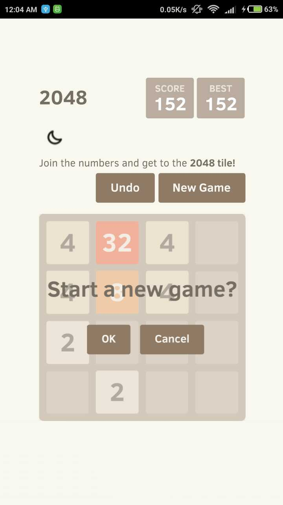

# flutter2048

 An Example of loading local html files (2048 game) with Flutter webView. Only 25 lines of code :)

### Plugins Used
  - <a href="https://github.com/fluttercommunity/flutter_webview_plugin"> flutter_webview_plugin </a> for webView
  - <a href="https://github.com/fluttercommunity/flutter_launcher_icons"> flutter_launcher_icons </a> for icon regeneration

## Screenshots

 - 

 - 

## Getting Started

For help getting started with Flutter, view our online
[documentation](https://flutter.io/).

